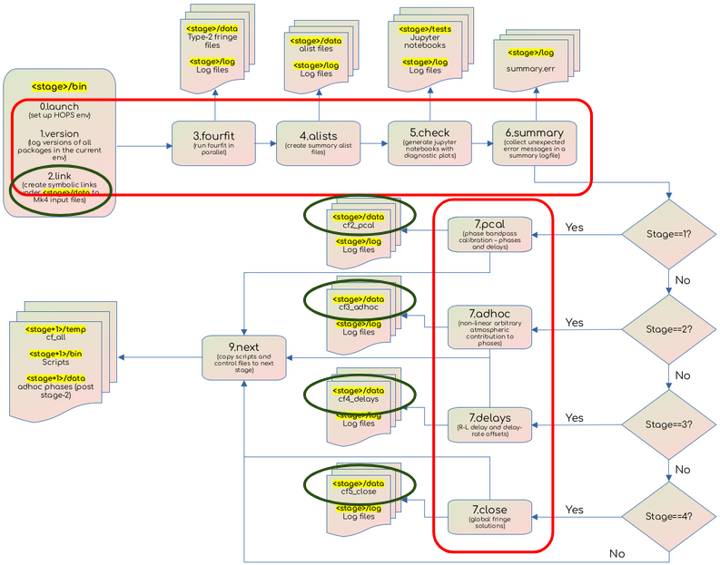

===================
Pipeline components
===================

The EHT-HOPS pipeline consists of stages of iterative fringe-fitting and post-processing.
A detailed description of the capabilities of the pipeline can be found in 
`Blackburn et al. (2019) <https://ui.adsabs.harvard.edu/abs/2019ApJ...882...23B/abstract>`_.

Stages in the pipeline
----------------------

   Control flow in the EHT-HOPS pipeline. The red boxes denote the scripts that are run in each stage of the pipeline.
   The blue boxes denote the location of the data to be calibrated; these data are symlinked from the local archive at the beginning of
   each stage, so that new copies of the same input data files are not created.

The primary function of the pipeline is to perform fringe-fitting or generalized phase calibration of the correlated data. Additional
post-processing steps include conversion of Mark4 data to UVFITS files, performing a priori amplitude calibration, field angle rotation
correction, R/L phase calibration, and network calibration. The pipeline is designed to be run in a series of stages, each of which
iteratively build more complex phase models to calibrate the data.

The `HOPS` `fourfit` program performs fringe-fitting. It takes as input a control file consisting of commands that control data selection
and the calibration parameters to be used. The control files are either generated by the user by repeated inspection of the data and the
calibration solutions. Scripts in the EAT that perform additional calibration steps are also used to generate control files which are passed
to `fourfit` in the next stage.

Fringe-fitting is performed in stages 0 to 5 (**0.bootstrap** with minimal constraints on fringe-fitting, to **5.+close** with an iteratively built
complex phase model), with each stage building on the solutions derived in the previous stage. These stages consist of the following common steps:

- **0.launch** -- sets up the environment variables and launches the pipeline
- **1.version** -- logs the versions of all external dependencies
- **2.link** -- links the archival data to the working directory
- **3.fourfit** -- fringe-fits the data
- **4.alists** -- creates the summary alist files
- **5.check** -- generates summary jupyter notebooks with diagnostic plots for the data
- **6.summary** -- collects all the errors and warnings from the previous steps in a single logfile
- **9.next** -- copies some files to the next stage

The stage-specific steps (usually step 7) derive additional solutions which are written out to control files that are input to the following stages.

- Stage **1.+flags+wins** applies flags and search windows and derives phase bandpass solutions in step **7.pcal**.
- Stage **2.+pcal** applies bandpass phase calibration solutions and derives adhoc phase solutions using **7.adhoc**.
- Stage **3.+adhoc** applies adhoc phase solutions and derives R/L delay solutions using **7.delays**.
- Stage **4.+delays** applies delay calibration solutions and globalizes fringe solutions using **7.close**.
- Stage **5.+close** applies global fringe closing solutions.

The post-processing stages are not part of the main pipeline workflow, but are run as needed. 
- Stage 6 (**6.uvfits**) creates uvfits files from the fringe-fitted data in mk4 format. Starting from this stage, the uvfits files are used as inputs
  for the subsequent stages.
- Stage 7 (**7.apriori**) performs apriori amplitude calibration (after deriving SEFDs using metadata from ANTAB, VEX, and array.txt files) and field angle rotation correction.

Automatic simultaneous multi-band data processing is not supported by the pipeline yet. Each band is processed independently.
To avoid code duplication, symbolic links to scripts in band 1 (**hops-b1**) are used to run other bands.

.. _data-organization:

Data organization
-----------------

The inputs and outputs of the HOPS fourfit program confirm to the specifications of the Mark 4 (mk4) data format.
The command-line arguments to the pipeline described below are designed around some basic assumptions about the data organization.
All input mark4 files are expected to be organized according to the following directory structure:

- SRCDIR

  - CORRDAT, a colon-separated list of data directories (correlation products) to use for SRC data, with higher precedence coming first.

    - Variable levels of subdirectories, the number of which determines the value passed to the -d option passed to the 0.launch script.

      - Directories named after the pattern passed to the -p option passed to the 0.launch script.

        - Directories with names corresponding to the HOPS expt no.

          - Directories with names corresponding to the scan no. containing the input mk4 files.

Refer to the :ref:`command-line-options` section for more information on how data organization determines the options passed to the 0.launch script.

Metadata organization
---------------------

The metadata directory for each campaign and each observing frequency contains HOPS control files (**cf**) used for fringe-fitting
and VEX, ANTAB, and array.txt files used only for post-processing.
The **ehthops/meta** directory hosts the metadata and is structured as follows:

- <campaign>
 - <frequency>
  - cf
   - cf[0-9]_b[1234]_* (Stage and band-specific control files)
  - ANTAB
   - <track>_<band>_proc.AN
  - VEX
   - <track>.vex
  - array.txt

The pipeline scripts pick the appropriate control files (from the **cf** subdirectory) and other relevant metadata during
execution as long as the above directory organization and naming conventions are followed.
