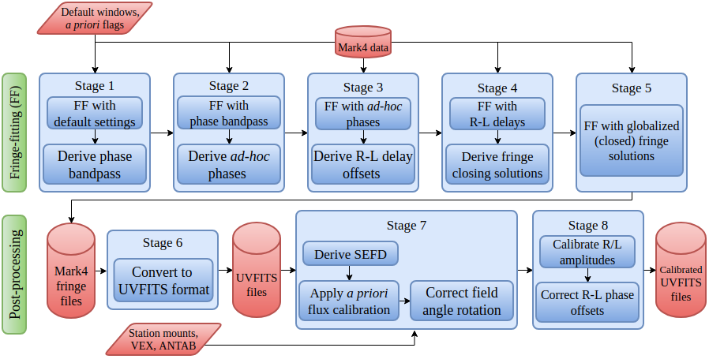

===================
Pipeline components
===================

The EHT-HOPS pipeline consists of five stages of iterative fringe-fitting and post-processing calibration stages.
A detailed description of the capabilities of the pipeline can be found in 
`Blackburn et al. (2019) <https://ui.adsabs.harvard.edu/abs/2019ApJ...882...23B/abstract>`_.

.. _pipeline_stages:

Stages in the pipeline
----------------------

   A typical EHT-HOPS pipeline workflow (Natarajan et al., in prep).

The HOPS ``fourfit`` program performs fringe-fitting. It takes as input a control file consisting of commands that control data selection
and the calibration parameters to be used. Calibration scripts in the ``eat`` library are also used to generate control files which are passed
to `fourfit` in the following stage. The control files can also include commands added by the user manually after inspecting the data and the
calibration solutions.

Fringe-fitting is performed in stages 0 to 5, with each stage building on the solutions derived in the previous stage.
All stages consist of the following common steps:

- ``0.launch`` -- sets up the environment variables and launches the pipeline.
- ``1.version`` -- logs the versions of all python dependencies.
- ``2.link`` -- links the archival data to the working directory.
- ``3.fourfit`` -- performs fringe-fitting using the control files generated in the previous stage.
- ``4.alists`` -- creates the summary alist files.
- ``5.check`` -- generates summary ``marimo`` notebooks with diagnostic plots using the output alist files and the fringe-fitting solutions.
- ``6.summary`` -- collects all the errors and warnings from the previous steps in a single logfile.
- ``9.next`` -- sets up the environment for the next stage (copying scripts and control files as necessary).

The stage-specific steps (usually step 7) perform additional operations and write out control files to be input to the following stages.

- ``7.pcal`` in stage ``1.+flags+wins`` -- applies flags and search windows and derives phase bandpass solutions.
- ``7.adhoc`` in stage ``2.+pcal`` -- applies bandpass phase calibration solutions and derives adhoc phase solutions.
- ``7.delays`` in stage ``3.+adhoc`` -- applies adhoc phase solutions and derives R/L delay solutions.
- ``7.close`` in stage ``4.+delays`` -- applies delay calibration solutions and globalizes fringe solutions.

Stage ``5.+close`` performs one final round of fringe-fitting in which all the solutions are applied.

The post-processing stages are not part of the main pipeline workflow, and are run only as needed:

- Stage ``6.uvfits`` generates ``UVFITS`` files from the Mk4 fringe files. Starting from this stage, the uvfits files are used as inputs to the subsequent stages.
- Stage ``7.apriori`` derives SEFDs using metadata from *antab/*, *vex/*, and *array.txt* files) and performs amplitude calibration and field angle rotation correction.
- Stage ``8.+polcal`` performs R/L gain ratio calibration.

.. todo::
  Automatic simultaneous multi-band data processing is not supported by the pipeline yet. Each band is processed independently.

.. _data-organization:

Data organization
-----------------

The inputs and outputs of the HOPS ``fourfit`` program conform to the
specifications of the Mark 4 (``mk4``) data format.

The command-line arguments to the pipeline described below are designed around minimal assumptions about how the input data are organized.
These assumptions are necessary since, unlike a CASA Measurement Set, Mark4 data are distributed among thousands of data files in a custom
directory structure. All input Mark 4 files are expected under this directory structure::

    SRCDIR/
    └── CORRDAT/
        └── <intermediate subdirectories (multiple levels)>/
            └── <expt_no>/
                    └── <scan_no>/
                        └── <input mk4 files>

where

``SRCDIR``
    The top-level source directory.

``CORRDAT``
    A colon-separated prioritized list of data directories containing the data. Directories listed earlier take higher precedence.

``<intermediate subdirectories (multiple levels)>``
    Zero or more levels of subdirectories.

``<expt_no>``
    Directory names corresponding to the HOPS experiment number.

``<scan_no>``
    Directory names corresponding to the scan number. These directories contain all input ``mk4`` files corresponding to a single scan.

Refer to the :ref:`launching-the-pipeline` section for more information on how
the data organization determines the options passed to the ``0.launch`` script at each stage.

.. _metadata-organization:

Metadata organization
---------------------

The metadata directory (by default, found under ``ehthops/meta``) is organized by campaign and observing frequency and contains:

- HOPS control files (``cf*``) used for fringe fitting.
- ``vex/``, ``antab/``, and ``array.txt`` files used only for post-processing calibration.

.. note::
  The ``antab/`` files are not released with the pipeline by default due to their large size. Users must ensure that the
  ``antab/*.AN`` files are created from the official ANTAB files found under ``antab/processed`` directory in the metadata
  package released by the EHTC.

The metadata directory (by default, found under ``ehthops/meta``) must be organized as follows::

    <campaign>/
    └── <frequency-in-GHz>GHz/
        ├── cf/
        │   └── cf[0-9]_b[1234]_*      # Stage- and band-specific control files
        ├── antab/
        │   └── <track>_<band>_proc.AN
        ├── vex/
        │   └── <track>.vex
        └── array.txt

Refer to the :ref:`launching-the-pipeline` section for more information on how to set ``METADIR``
environment variable at each stage in the ``0.launch`` script.